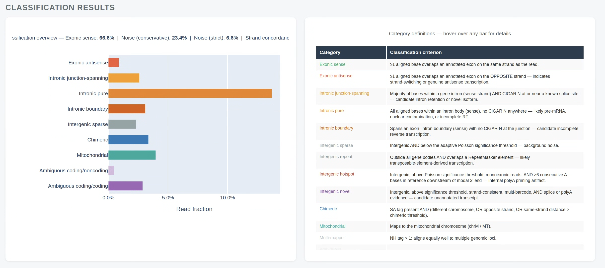

# scNoiseMeter

[](https://doi.org/10.5281/zenodo.19554841)

Platform-agnostic quantification of technical noise in single-cell RNA-seq BAM files.

scNoiseMeter measures technical noise in single-cell RNA-seq from a coordinate-sorted BAM and a GTF. Unlike most QC tools that report a single "% noise", it classifies every primary alignment into one of 19 mutually exclusive categories and tells you what kind of noise you have: chimeric reads, intronic variants, intergenic artifacts, ambiguous gene overlaps, TSO invasion, and polyA priming, among others. It also reports per-sample and per-cell noise fractions, strand concordance, chimeric rates, and artifact flag counts.

Same logic runs on ONT, PacBio/Kinnex, short-read (Illumina, ElemBio) BAMs from 10x Genomics or BD Rhapsody kits, and Smart-seq / FLASH-seq plates (96- and 384-well), with platform-specific adjustments where the underlying biology differs.

Current version: **0.4.1**.

---

## Installation

```bash
pip install scnoisemeter
```

Python >= 3.9 required. Dependencies (pysam, pyranges, pandas, numpy, click, plotly, scipy, tqdm) are installed automatically.

Development extras:

```bash
pip install "scnoisemeter[dev]"
```

The input BAM must be coordinate-sorted and indexed before use:

```bash
samtools sort -o sorted.bam input.bam
samtools index sorted.bam
```

---

## Quick start

```bash
# GTF and PolyASite atlas are auto-downloaded on first use
scnoisemeter run \
  --bam sample.bam \
  --output-dir results/
```

Platform is auto-detected from the BAM header and every flag shown in the `run` section below is optional tuning. The minimal invocation above works end-to-end on any supported BAM.



*Sample view from the generated HTML report. The full report also covers sample metadata, read vs base fractions, length-stratified noise, per-cell noise distributions, artifact flag rates, and intergenic locus scoring — see `docs/report_preview1.png` through `docs/report_preview6.png` for the complete tour.*

Output files written to `results/`:

| File | Contents |
|---|---|
| `<sample>.read_metrics.tsv` | Sample-wide noise fractions, strand concordance, artifact counts |
| `<sample>.cell_metrics.tsv` | Per-cell breakdown for every cell with >= 10 reads |
| `<sample>.intergenic_loci.tsv` | Characterised intergenic loci with Poisson significance scores |
| `<sample>_length_stratified.tsv` | Read counts and fractions by length bin x category |
| `<sample>.multiqc.json` | MultiQC-compatible custom content |
| `<sample>.report.html` | Interactive Plotly report |

---

## Subcommands

### `run` — single BAM

Classify reads and produce all output files.

```bash
scnoisemeter run \
  --bam sample.bam \
  --gtf gencode.v45.annotation.gtf.gz \
  --barcode-whitelist 3M-february-2018.txt \
  --cell-barcodes filtered_feature_bc_matrix/barcodes.tsv.gz \
  --platform ont \
  --threads 16 \
  --output-dir results/
```

### `run-plate` — Smart-seq / FLASH-seq plate

Classify reads from a plate of one-cell-per-BAM Smart-seq wells and aggregate the results. Each well is processed independently and the per-well metrics are merged into a plate-level report. Works with 96-well (rows A-H) and 384-well (rows A-P) plates.

```bash
scnoisemeter run-plate \
  --plate-dir /data/plate_881/ \
  --sample-sheet plate_881.csv \
  --platform smartseq \
  --parallel-wells 8 \
  --threads 16 \
  --output-dir results/
```

`--plate-dir` is expected to contain one subdirectory per well named `<PlateID>_<WellID>` (e.g. `881_A1`, `881_H12`, `882_P24`). Each subdirectory must hold the well's sorted, indexed BAM. `--parallel-wells` runs multiple wells concurrently via a `ProcessPoolExecutor`; the annotation index and polyA/TSS site dictionaries are loaded once per worker and reused across all wells assigned to that worker. `--plate-id` restricts processing to a subset of plates without re-running the rest.

### `compare` — pre/post-filter

Run classification on two BAMs and test each read category for statistically significant composition shifts (chi-squared, Bonferroni-corrected).

```bash
scnoisemeter compare \
  --bam-a raw.bam \
  --bam-b filtered.bam \
  --label-a pre_filter \
  --label-b post_filter \
  --threads 8 \
  --output-dir compare_results/
```

Produces `comparison.metrics.tsv`, `comparison.stats.tsv`, and `comparison.report.html`.

### `discover` — batch directory

Scan a directory for BAM files, infer platform and pipeline stage from each header, and run `scnoisemeter run` on selected or all files. The annotation index is built once and shared across all BAMs.

```bash
# Interactive: inspect all BAMs and prompt for selection
scnoisemeter discover \
  --bam-dir /data/bams/ \
  --reference GRCh38.fa \
  --output-dir discover_results/

# Non-interactive: run all BAMs with inferable parameters
scnoisemeter discover \
  --bam-dir /data/bams/ \
  --reference GRCh38.fa \
  --output-dir discover_results/ \
  --run-all
```

---

## Read categories

Every read receives exactly one category. The classification hierarchy is applied in the order listed below; a read is assigned the first matching category.

| Category | What it means |
|---|---|
| `multimapper` | NH tag > 1 on the primary alignment |
| `chimeric` | Inter-chromosomal or strand-discordant SA split; or same-strand intra-chromosomal distance > 10 kbp; or paired-end insert size > 1 Mbp |
| `mitochondrial` | Maps to chrM / MT |
| `exonic_sense` | Overlaps an annotated exon on the correct strand |
| `exonic_antisense` | Overlaps an annotated exon on the wrong strand |
| `intronic_jxnspan` | Intronic with a CIGAR N operation near a splice site |
| `intronic_pure` | Entirely within an intron body, no junction signal |
| `intronic_boundary` | Spans an exon-intron boundary without a splice operation |
| `intergenic_repeat` | Intergenic, overlapping a RepeatMasker interval (requires `--repeats`) |
| `intergenic_hotspot` | Intergenic locus above the adaptive threshold with an internal-priming signature |
| `intergenic_novel` | Intergenic locus above threshold, near an annotated polyA site; candidate novel gene |
| `intergenic_sparse` | Intergenic locus below the adaptive threshold |
| `ambiguous` | Overlaps a region shared by multiple genes |
| `ambiguous_cod_ncod` | Shared region between a coding gene and a non-coding gene |
| `ambiguous_cod_cod` | Shared region between two protein-coding genes |
| `unassigned` | CB tag absent or not on the barcode whitelist |

### Noise definitions

Two noise levels are reported.

**Conservative** (`noise_read_frac`): exonic antisense + all intronic subtypes + intergenic sparse / repeat / hotspot + chimeric. Upper bound on true technical noise.

**Strict** (`noise_read_frac_strict`): same, minus `intronic_pure` and `intronic_boundary`, which may reflect genuine pre-mRNA capture. Lower bound; unambiguous artifacts only.

**Unstranded** (Smart-seq / FLASH-seq): `exonic_antisense` is excluded from both conservative and strict noise because unstranded libraries produce sense and antisense reads in roughly equal proportion by design. Activated automatically when `--platform smartseq` is set.

The categories `intronic_jxnspan`, `intergenic_novel`, and the three `ambiguous` variants are in neither noise set.

### Intergenic locus scoring

The classifier initially labels every intergenic read `intergenic_sparse`. A second pass clusters those reads into 500 bp windows and scores each locus against a Poisson background model (expected rate from total intergenic base coverage). Loci must meet minimum thresholds (>= 5 reads, >= 3 distinct barcodes or >= 0.01% of total barcodes) and pass a Bonferroni-corrected p < 0.01 before being promoted to `intergenic_hotspot`, `intergenic_novel`, or `intergenic_repeat`. Reads at promoted loci are moved out of the sparse bucket before any noise fraction is computed, so a locus promoted to `intergenic_novel` (ambiguous, not noise) reduces the reported noise fraction.

---

## Platform support

| Platform | Auto-detected from | Chimeric logic | Length charts | Strandedness |
|---|---|---|---|---|
| ONT | `minimap2` @PG | SA tag, 10 kbp threshold | Yes | Stranded |
| PacBio / Kinnex | `pbmm2` @PG | SA tag, 10 kbp threshold | Yes | Stranded |
| 10x Genomics (short-read) | `STAR` / `STARsolo` / `cellranger` @PG | Paired-end insert size | Suppressed | Stranded |
| BD Rhapsody (short-read) | `STAR` @PG | Paired-end insert size | Suppressed | Stranded |
| Smart-seq / FLASH-seq (96- and 384-well) | set explicitly with `--platform smartseq` | Paired-end insert size | Yes (when long enough) | Unstranded |

Short-read BAMs from either Illumina or ElemBio (AVITI) sequencers are handled identically; the row label reflects the library kit, not the sequencer vendor. Pass `--platform` explicitly to override auto-detection. Smart-seq is not auto-detected from the header and must be set explicitly; doing so selects the unstranded noise definition and suppresses the "missing CB tag" warning that is expected for one-cell-per-BAM data.

---

## Key options

| Flag | Default | Notes |
|---|---|---|
| `--bam` | required | Coordinate-sorted, indexed BAM (ignored by `run-plate`) |
| `--plate-dir` | required for `run-plate` | Directory with one `<PlateID>_<WellID>/` subfolder per well |
| `--sample-sheet` | optional for `run-plate` | CSV mapping wells to metadata; headerless sheets are auto-detected |
| `--plate-id` | none | Restrict `run-plate` to the listed plate IDs (repeatable) |
| `--parallel-wells` | 1 | Number of wells to process concurrently in `run-plate` |
| `--gtf` | auto-downloaded | GENCODE GTF (plain or .gz); takes precedence over `--gtf-version` |
| `--gtf-version` | none | GENCODE release to auto-download, e.g. `42`; ignored when `--gtf` is set |
| `--polya-sites` | auto-downloaded | PolyA site BED file(s); repeatable; overrides `--polya-db` |
| `--polya-db` | `polyasite3` | `polyasite3`, `polyadb4`, or `both`; controls auto-download when `--polya-sites` is absent |
| `--tss-sites` | auto-downloaded | CAGE/TSS BED file(s); repeatable; overrides `--tss-db` |
| `--tss-db` | `fantom5` | `fantom5` or `none`; controls auto-download when `--tss-sites` is absent |
| `--barcode-whitelist` | none | Off-list reads classified as `unassigned` |
| `--cell-barcodes` | none | Called-cell list; uncalled reads skipped entirely |
| `--reference` | none | Reference FASTA; required for polyA context checks and non-canonical junction detection |
| `--repeats` | none | RepeatMasker BED; required for `intergenic_repeat` classification |
| `--obs-metadata` | none | Per-cell cluster metadata TSV; enables per-cluster noise profiles |
| `--platform` | auto | `ont`, `pacbio`, `illumina`, `illumina_10x`, `illumina_bd`, `smartseq`, `unknown` |
| `--pipeline-stage` | auto | `raw`, `pre_filter`, `post_filter`, `custom` |
| `--threads` | 4 | One worker process per chromosome within a single BAM |
| `--chimeric-distance` | 10000 | SA-tag intra-chromosomal distance threshold (bp) |
| `--no-umi-dedup` | off | Skip UMI tracking; reduces memory for large datasets |
| `--offline` | off | Use only cached files; no network calls |
| `--no-cache` | off | Skip reading and writing the annotation index cache |

---

## Caching

On first run, scNoiseMeter downloads the latest GENCODE GTF and PolyASite 3.0 atlas to `~/.cache/scnoisemeter/`. Subsequent runs reuse those files without a network call. Three independent caches live in that directory:

- **Annotation index**: parsed GTF stored as a compressed pickle next to the source GTF. Rebuilding from a large GENCODE GTF takes roughly 60 seconds. Pass `--no-cache` to force a rebuild.
- **PolyA site dict**: loaded once from BED and pickled. Keyed on file path, mtime, size, a hash of the first 64 KB, and chromosome style. First load is ~35 s on the 569k-site PolyASite 3.0 atlas; subsequent loads are under 1 s. In `run-plate` this cache is the reason per-well startup is fast.
- **TSS / CAGE site dict**: same caching scheme as polyA.

Supply `--gtf` and `--polya-sites` explicitly to use specific versions, or use `--gtf-version N` to auto-download a specific GENCODE release without needing the file locally. `--offline` raises an error if the cache is empty.

**GTF vs PolyASite version mismatch.** The current PolyASite 3.0 atlas is built on GENCODE v42. Auto-downloading the latest GTF (currently v49) produces a seven-version gap, and scNoiseMeter warns when the difference exceeds five major releases. Transcripts annotated in v43-v49 (a substantial number of novel lncRNAs were added in that window) will be classified correctly by the GTF but will not benefit from polyA anchoring. The `full_length_read_frac` metric and `intergenic_novel` calls are the most affected. Two ways to resolve this:

- Pass `--gtf-version 42` to auto-download GENCODE v42, matching the PolyASite 3.0 atlas exactly.
- Pass `--polya-db polyadb4` to switch to PolyA_DB v4, which is not tied to a GENCODE version and works with any GTF release.

---

## Requirements and caveats

**Genome.** GRCh38/hg38 only. Mouse and other species produce chromosome-length warnings but do not abort. Chromosome naming (UCSC `chr1` vs Ensembl `1`) must match between the BAM and the GTF; a mismatch is fatal.

**Alignments.** Only primary alignments are classified. Secondary (flag 0x100) and supplementary (flag 0x800) records are skipped; supplementary records are read by the chimeric detector only.

**`multimapper`.** NH > 1 reads currently receive their genomic category (e.g. `exonic_sense`) rather than the `multimapper` category. The `is_multimapper` flag is computed but not assigned — an intentional choice to keep multimappers in their biological context; the per-sample `multimapper_read_frac` metric is still reported. This is documented behavior, not a bug.

**`intronic_pure` / `intronic_boundary`.** These categories cannot be distinguished from genuine pre-mRNA capture at the read level. They appear in conservative noise but not strict noise.

**`compare` statistics.** The chi-squared test is not a paired test and does not account for BAM B being a subset of BAM A. Interpret p-values accordingly.

**Long transcripts.** The default chimeric distance of 10 kbp may flag legitimate split alignments for transcripts longer than 10 kb. Increase `--chimeric-distance` for such datasets.

**`intergenic_repeat`.** Requires a RepeatMasker BED file (`--repeats`). Without it, repeat-overlapping intergenic reads fall into `intergenic_hotspot` or `intergenic_sparse`.

**Smart-seq.** `--platform smartseq` must be set explicitly; it is not auto-detected. Per-cell metrics and `n_cells` report `N/A` for Smart-seq because one BAM corresponds to one cell; the plate-level report aggregates across wells. Strand concordance and TSS/polyA anchoring are interpreted differently in unstranded data and are annotated as such in the HTML report.

---

## Full documentation

See [docs/documentation.md](docs/documentation.md) for complete flag descriptions, output column definitions, platform-specific notes, the plate workflow, and statistical methodology.

---

## Citation

If you use scNoiseMeter in your work, please cite the archived version via the concept DOI (always resolves to the latest release):

> Picelli, S. scNoiseMeter: platform-agnostic quantification of technical noise in single-cell RNA-seq. Zenodo. https://doi.org/10.5281/zenodo.19554841

BibTeX:

```bibtex
@software{picelli_scnoisemeter,
  author  = {Picelli, Simone},
  title   = {scNoiseMeter: platform-agnostic quantification of technical noise in single-cell RNA-seq},
  url     = {https://github.com/FullLengthFanatic/scnoisemeter},
  doi     = {10.5281/zenodo.19554841}
}
```

---

## License

MIT
