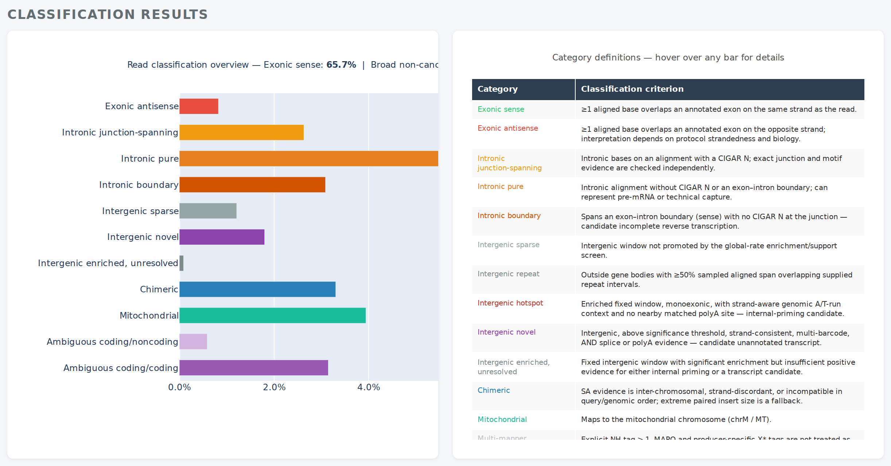

# scNoiseMeter

[](https://doi.org/10.5281/zenodo.19554841)

Barcode-aware alignment artifact and read-distribution QC for single-cell RNA-seq BAM files.

scNoiseMeter assigns each mapped primary alignment to one of 17 mutually exclusive output categories, partitions its aligned reference bases without double-counting, and reports independent artifact-evidence flags. It supports barcode-aware droplet data, barcode-free BAMs, pre/post-filter comparisons, and Smart-seq/FLASH-seq plate aggregation.

Version **0.8.0** deliberately avoids presenting a single category sum as a causal estimate of “technical noise.” It reports:

- `broad_noncanonical_*`: a descriptive composition of antisense, selected intronic and intergenic categories, hotspots, and chimeric alignments;
- `artifact_candidate_*`: the narrower subset with positive alignment/context evidence (`intergenic_hotspot` and `chimeric`);
- deprecated `noise_*` aliases for compatibility with existing workflows.

The [white paper](docs/whitepaper.md) explains the scientific model and literature context. [Annotated methods](docs/methods_annotated.md) maps the rules to code. [Full documentation](docs/documentation.md) is the operational reference. These files are intentionally separate.

## Installation

```bash
pip install git+https://github.com/FullLengthFanatic/scnoisemeter.git
```

For development:

```bash
git clone https://github.com/FullLengthFanatic/scnoisemeter.git
cd scnoisemeter
pip install -e ".[dev]"
pytest -q
```

Python 3.9 or newer is required. Input BAMs must be coordinate-sorted and indexed:

```bash
samtools sort -o sorted.bam input.bam
samtools index sorted.bam
```

## Quick start

```bash
scnoisemeter run \
  --bam sample.bam \
  --platform ont \
  --library-strand stranded \
  --output-dir results/
```

Add `--tagged-bam results/sample.classified.bam` to make a coordinate-sorted, indexed copy with the final category in local SAM tag `sn`. The option retains read assignments in memory and performs a second BAM pass, so it is off by default.

GENCODE, polyA, and TSS resources can be downloaded and cached automatically. For reproducible scientific work, provide explicit versions and strandedness:

```bash
scnoisemeter run \
  --bam sample.bam \
  --gtf gencode.v45.annotation.gtf.gz \
  --reference GRCh38.fa \
  --repeats hg38.repeatmasker.bed.gz \
  --cell-barcodes filtered_feature_bc_matrix/barcodes.tsv.gz \
  --platform ont \
  --library-strand stranded \
  --seed 42 \
  --threads 8 \
  --output-dir results/
```

Do not rely on an aligner name alone to identify the sequencer or library. `minimap2` is not proof of ONT, and bare `STAR` is not proof of Smart-seq. Ambiguous headers produce a warning; use `--platform` and `--library-strand` explicitly.

## Report preview



The interactive HTML report also covers [sample metadata](docs/report_preview1.png), [read and base fractions](docs/report_preview3.png), [length-stratified and per-cell composition](docs/report_preview4.png), [read-length distributions and artifact flags](docs/report_preview5.png), and [the top intergenic loci](docs/report_preview6.png).

These screenshots come from chr17, chr19-chr22 and chrM of a 10x Kinnex sample, kept small so the previews stay current. Restricting to six contigs raises the mitochondrial share well above what the whole sample shows, so read the panels as a tour of the layout rather than as typical values.

## Classification

Unmapped, secondary, and supplementary records are counted separately and excluded from the genomic-category denominator. Remaining primary alignments are processed in this priority order. The historical `read_*` names mean alignment records; paired mates count separately. Version 0.7 also emits precise `n_records_*` and `n_alignments_classified` aliases.

| Category | Interpretation |
|---|---|
| `unassigned` | Barcode missing/off-whitelist when a whitelist is enforced |
| `multimapper` | Explicit `NH>1` evidence. MAPQ and producer-specific `X*` tags do not replace the genomic category; low MAPQ is reported separately |
| `mitochondrial` | Primary alignment is on `chrM`, `MT`, `chrMT`, or `mitochondrion` |
| `chimeric` | Inter-contig or strand-discordant `SA`, incompatible query/genomic split order, or extreme paired insert size |
| `ambiguous_cod_cod` | Same-strand region shared by protein-coding genes |
| `ambiguous_cod_ncod` | Same-strand region shared by coding and non-coding genes |
| `exonic_sense` | Exonic overlap on the read strand |
| `exonic_antisense` | Exonic overlap on the opposite strand |
| `intronic_jxnspan` | Intronic bases on an alignment containing a CIGAR `N` |
| `intronic_boundary` | Exonic and intronic bases without a splice operation |
| `intronic_pure` | Intronic bases without boundary or junction evidence |
| `intergenic_repeat` | At least 50% of sampled aligned span overlaps supplied repeat intervals |
| `intergenic_hotspot` | Enriched fixed window with a strand-aware genomic polyA-run signature, away from an annotated polyA site |
| `intergenic_novel` | Enriched, strand-consistent, multi-barcode window with splice or annotated polyA-end support |
| `intergenic_enriched` | Enriched window lacking evidence for a more specific interpretation |
| `intergenic_sparse` | Intergenic window below the enrichment/support thresholds |
| `ambiguous` | Defensive fallback for an otherwise unresolved alignment |

Aligned blocks are split at every annotation boundary. Each atomic segment receives exactly one base category, so base counts sum exactly to aligned reference bases even in complex overlaps. Same-strand gene sharing is ambiguous; overlapping genes on opposite strands remain strand-resolvable.

Genomic distance by itself is not used to call an RNA split chimeric: a long gap may simply be an intron. Orphan/improper pairs are reported as `discordant_pair` flags and are not automatically called chimeric.

## Intergenic enrichment

Intergenic reads are assigned by their strand-correct 3′ coordinate to predefined 500 bp windows. Using BAM contig lengths, the denominator is the exact complement of the union of gene bodies through each non-mitochondrial contig end. The profiler tests all possible windows (including empty windows) and applies a Bonferroni correction. This is a heuristic enrichment screen, not a peak caller: it does not model local background, GC content, or mappability.

Strand consistency is measured after window assignment. A window can therefore fail strand evidence rather than being split into artificial strand-specific loci. Significant unresolved windows become `intergenic_enriched`, not `intergenic_hotspot`.

For datasets larger than the 500,000-record intergenic reservoir, promoted read/base totals are estimated from a uniform reservoir. UMI-diversity fields for affected categories are emitted as missing because exact category-specific UMI sets cannot be reconstructed from a sample.

## Independent evidence flags

Flags do not change the mutually exclusive read category:

- TSO invasion: approximate prefix match at the molecularly appropriate soft-clipped end; one substitution is tolerated.
- TSO concatemer: multiple approximate full-motif occurrences.
- Internal polyA priming: downstream A-run on `+` or upstream T-run on `-`; requires a reference FASTA.
- Non-canonical junction: exact donor and acceptor checked in transcript orientation; exact annotated junctions are accepted.
- Discordant pair: orphan or improper paired alignment.
- Low MAPQ: descriptive `MAPQ < 10` flag; no read is filtered by this threshold.

CLI TSO defaults are protocol-aware. ONT/10x uses the 10x motif, PacBio/Smart-seq uses the SMART/PacBio motif, and generic Illumina, BD, or unknown inputs use no motif unless `--tso` is supplied. The poly-G shortcut is enabled only with the built-in 10x motif.

## End anchoring and alignment quality

“Full-length” is not inferred from read length. For the same reservoir-sampled exonic-sense read, scNoiseMeter reports:

- `three_prime_anchored_frac`: 3′ end near a strand-matched polyA site;
- `five_prime_anchored_frac`: 5′ end near a strand-matched TSS/CAGE site;
- `both_ends_anchored_frac`: both conditions on that same read;
- deprecated `full_length_read_frac`: alias of `both_ends_anchored_frac`, only when both atlases are available.

These fractions are suppressed for explicitly unstranded libraries because read orientation does not identify transcript ends. Alignment-quality outputs include mean MAPQ, mean `NM` where present, soft-clipped/query-base fraction, unmapped fraction from BAM index counts, and primary/secondary/supplementary/QC-fail/duplicate totals.

`umi_sequence_diversity_<category>` is unique UMI strings divided by reads. It is not molecule complexity because UMIs are not grouped by gene/locus or error-corrected. The older `umi_complexity_*` columns remain aliases.

## Commands

### One BAM

```bash
scnoisemeter run --bam sample.bam --output-dir results/
```

### Pre/post-filter comparison

```bash
scnoisemeter compare \
  --bam-a raw.bam \
  --bam-b filtered.bam \
  --label-a pre \
  --label-b post \
  --output-dir comparison/
```

The comparison does not use an invalid independent-samples chi-square test. It produces exact read-key retention and transition tables plus descriptive composition deltas and a paired-cell bootstrap interval for the median per-cell change.

Retention and transitions require the two BAMs to be the *same reads* before and after a step. `compare` samples read names from both BAMs and, when they do not match, skips those tables and says so rather than emitting NaN. This also avoids holding a per-read map of both BAMs in memory, which for two long-read samples runs to tens of gigabytes. Note that some deduplicators rewrite read names (`isoseq dedup` replaces PacBio CCS names with `molecule/N`), so a genuine pre/post pair can still be unmatchable; the composition metrics remain valid. Force either behaviour with `--matched-reads` / `--no-matched-reads`.

### Many samples

```bash
scnoisemeter cohort \
  --results results/BD46/ \
  --results results/10x_FL/ \
  --results results/PIPseq/ \
  --sample-sheet cohort.tsv \
  --output-dir cohort/
```

Compares any number of independent samples by reading the metrics `run` already wrote, so it takes seconds rather than the hours a re-classification would need. Use it whenever the samples are separate experiments; use `compare` only for a nested pre/post pair of the same reads.

The optional sample sheet has columns `sample`, `label`, `group`, `order`, where `sample` matches the `<sample>.read_metrics.tsv` stem. Without it, samples are labelled by that stem and ordered cleanest first.

The report carries four figures: composition per sample with exonic sense excluded so the differences are not compressed into the tail of the bar; a heatmap coloured by deviation from the cohort median, which shows what is *unusual* about a method rather than restating the composition; artifact-flag rates on a log axis, since those span several orders of magnitude; and per-cell spread for whichever samples have barcodes.

Samples that came from different scnoisemeter versions, different GENCODE releases, or a mix of stranded and unstranded protocols are flagged in the report. Metrics that a sample never reported are shown as absent, never as zero.

### Directory discovery

```bash
scnoisemeter discover \
  --bam-dir /data/bams \
  --reference GRCh38.fa \
  --run-all \
  --output-dir batch_results/
```

### Plate data

```bash
scnoisemeter run-plate \
  --plate-dir /data/plate_881 \
  --sample-sheet plate_881.csv \
  --platform smartseq \
  --library-strand unstranded \
  --parallel-wells 8 \
  --output-dir results/
```

Barcode-free well BAMs are relabeled to `<plate>_<well>` before aggregation, preventing all wells from collapsing into a single `NO_BARCODE` pseudo-cell.

## Outputs

| File | Contents |
|---|---|
| `<sample>.read_metrics.tsv` | Denominators, category fractions, aggregate compositions, flags, endpoint and alignment-quality metrics |
| `<sample>.cell_metrics.tsv` | Per-cell category, aggregate, flag, UMI-diversity, and alignment-quality metrics (cells with at least 10 reads) |
| `<sample>.intergenic_loci.tsv` | Coordinates, strand/repeat evidence, raw and adjusted Poisson p-values, final category |
| `<sample>_length_stratified.tsv` | Exact category counts by length bin |
| `<sample>.length_distributions/` | Reservoir-sampled read lengths by category |
| `<sample>.cluster_metrics.tsv` | Optional summaries from `--obs-metadata` |
| `<sample>.multiqc.json` | MultiQC-compatible scalar content |
| `<sample>.report.html` | Interactive report |
| user path from `--tagged-bam` | Optional full BAM copy; classified primaries carry `sn:Z:<category>` |
| `comparison.retention.tsv` | Category-specific exact read retention |
| `comparison.transitions.tsv` | Category A→B transitions for matched read keys |
| `comparison.matching.tsv` | Overall matching counts |
| `comparison.stats.tsv` | Composition deltas and paired-cell bootstrap intervals |
| `<sample>.run_info.json` | Tool version, platform, strandedness and annotation sources for this run |
| `cohort.summary.tsv` | One row per sample: provenance and headline metrics |
| `cohort.composition.tsv` | Samples x categories, read and base fractions |
| `cohort.report.html` | Cross-sample report |

`comparison.retention.tsv`, `comparison.transitions.tsv` and `comparison.matching.tsv` are written only for a nested pair.

## Scope and limitations

- Classification is diagnostic; it does not remove reads or correct count matrices.
- Intronic, antisense, intergenic, mitochondrial, and chimeric observations can all reflect biology. Aggregate fields are compositions, not contamination estimates.
- `intergenic_novel` is a candidate label, not gene discovery. Validate with independent end, splice, expression, and replication evidence.
- A global Poisson background is approximate, especially near highly transcribed or poorly mappable regions.
- SA evidence can represent technical chimeras or genuine fusions.
- NUMT BED input records annotation provenance only. A NUMT read fraction is not claimed without competing-alignment evidence.
- Coordinate and annotation compatibility remain the user’s responsibility; the current automatic reference resources target human GRCh38.

## Citation and license

Please cite the archived concept DOI:

> Picelli, S. scNoiseMeter: barcode-aware alignment artifact and read-distribution QC for single-cell RNA-seq. Zenodo. https://doi.org/10.5281/zenodo.19554841

MIT licensed.
